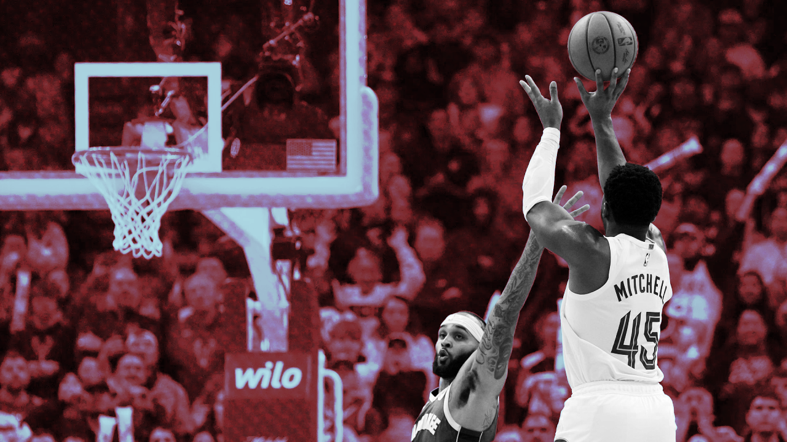

## **Is the 2-for-1 Really Worth It?**

Do NBA teams really mathematically benefit from going for 2-for-1s? Or are they better off taking their time and looking for a quality shot? To find out, I analyzed every potential 2-for-1 sequence in the NBA this past season to see if going for the extra possession was truly worth it.

**([Check out the full Substack write-up for this project here.](https://packinthepaint.substack.com/p/the-economics-of-basketball))**